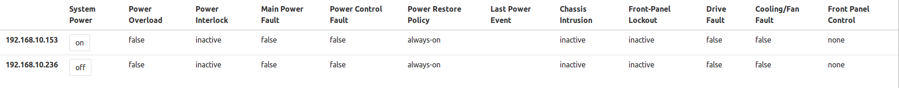

# Server manager

Manages and reports on your rack via BMCs.

Dependencies:
 - go lang:
   - dnf install golang
   - https://developer.fedoraproject.org/tech/languages/go/go-installation.html
 - task:
   - go get -u -v github.com/go-task/task/cmd/task
   - /home/<user>/.bashrc  >>  export PATH=$PATH:/$HOME/go/bin/
 - docker (v17 or higher)
   - https://docs.docker.com/install/linux/docker-ce/fedora/#install-docker-ce-1
 - docker-compose:
   - dnf install docker-compose
 - yarn:
   - https://yarnpkg.com/lang/en/docs/install/

Screenshot:

